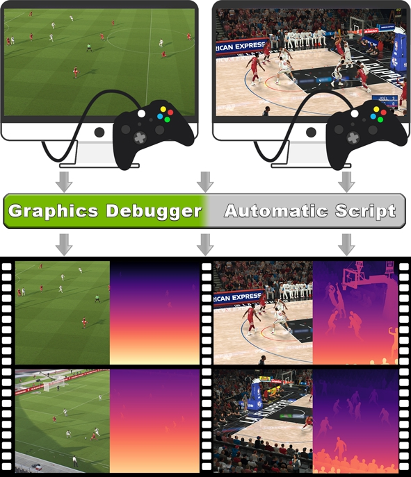

# SoccerNet-Depth


*SoccerNet-Depth* is the largest public dataset to provide depth estimation from team sports videos, with *12.4K* frames. Unlike other MDE sport datasets, SoccerNet-Depth contains scene-centric data from in-match scenarios. 
The dataset contains synthetic video sequences that makes it valuable for temporally consistent depth estimation. The color-depth pairs are collected from two popular video games, *NBA2K22 and EFootball*, through an automated extcraction process. 
The synthetic nature and automated extraction process makes the dataset scalable and the methodology transferable to any other sports video game.

This repository contains:

- **SoccerNet-Depth**: A new synthetic dataset for monucular depth estimation in sports videos.
- **Evaluation code**: The evaluation code used to benchmark the dataset using 5 state-of-the-art methods.
- **Automated extraction code**: The code used to extract autonomously the depth data from the games leveraging the Nvidia Nsight software as well as [PyAutoGUI](https://github.com/asweigart/pyautogui), [PyDirectInput](https://github.com/learncodebygaming/pydirectinput), and [ImageSearch](https://github.com/drov0/python-imagesearch/blob/master/README.md).

If you are interested for more information, refer to the paper:
[Paper](URL)



## SoccerNet-Depth dataset 
The dataset structure can be observed in the following representation:
```
SoccerNet-Depth/
├── Efootball/
│ ├── Train/
│ | ├── game_1.ext
| | | |── video_1
| | | | |── color
| | | | | |── 1.png
| | | | | |── ...
| | | | | |── n.png
| | | | |── depth 
| | | | | |── 1.png
| | | | | |── ...
| | | | | |── n.png
| | | | |── depth_r 
| | | | | |── 1.png
| | | | | |── ...
| | | | | |── n.png
| | | | |── depth_buffer
| | | | | |── 1.csv
| | | | | |── ...
| | | | | |── n.csv
| | | |── ...
| | | |── video_i
| | | | |── ...
| | |── ...
│ | ├── game_m.ext
| │ | ├── ...
│ ├── Test/
| │ ├── ...
│ └── Validation/
| │ ├── ...
└── Nba2K22/
│ ├── ...
```

Instructions to access the dataset will be soon available. Stay tuned !
## Evaluation code
The files associated to this evaluation code can be found [here](./evaluation/). 

To evaluate different state-of-the-art methods, we chose to use 5 different metrics: the absolute relative error (Abs Rel), the squared relative error (Sq Rel), the root-mean-square-error (RMSE), the root-mean-square error on the logarithm (RMSE log) and a scale invariant metric called SILog. The evaluation code computes the average metric between the predictions using a method and the ground truths from our dataset. 

To use our evaluation code, simply run the following command:
```
python evaluation.py  --sport <foot|basket> --path_pred </path/to/predictions>  --gt_path </path/to/gt>
```

All the arguments are mandatory. 
- **--gt_path**: Path to the directory that contains the ground truths depth maps. 
- **--path_pred**: Path to the predictions. Make sure to save your predictions as 16-bits PNG files with pixel depth values between 0 and 65,535.
- **--sport**: either foot or basket

Since the code sorts the predictions and ground truths alphabetically, make sure that the files from a pair gt/prediction are given a name that will ensure a correct ordering.  

## Extraction code
The files associated to this evaluation code can be found [here](./extraction/).

The scripts extract the depth information from the games NBA2K22 and EFootball in an automated fashion. Despite their important similarities a distinct script is provided for each game. This is mainly explained by the fact that the game menus are different and required tailored actions.

To run the code for NBA2K22, enter the following command:
```
python script_2K.py
```
To run the code for Efootball, enter the following command:
```
python script_efootball.py
```

The code included in this repository is the version that we used for our project. As such, it is tailored to our specific setup, which consists of two monitors, each with a resolution of 1920x1080. To facilitate data extraction, we opted to run the game on the left side of the screen, while Nvidia Nsight was positioned on the right side. Both software applications were run in full-screen mode.

To customize the code to your specific setup, we have included an auxiliary file named check_pos.py. This file contains a function that allows you to determine the pixel location of the elements you wish to automate a particular action with, like a click on a button for example.
To use this function, run the following command:
```
python check_pos.py
```
Then, once it is launched, move your mouse to the object you want to retrieve the pixel location, and press your *Enter* key. This will output a (x,y) value corresponding to the pixel location. 

## License
...

## Citation

For further information check out our [paper](URL).

Please cite our work if you use our dataset or code:

```bibtex
@inproceedings{Leduc2024SoccerNetDepth,
        title = {{SoccerNet-Depth}: a Scalable Dataset for Monocular Depth Estimation in Sports Videos},
        author = {Leduc, Arnaud and Cioppa, Anthony and Giancola, Silvio and Ghanem, Bernard and Van Droogenbroeck, Marc},
        booktitle = cvsports,
        month = Jun,
        year = {2024},
        address = city-seattle,
        keywords = {}
}
```